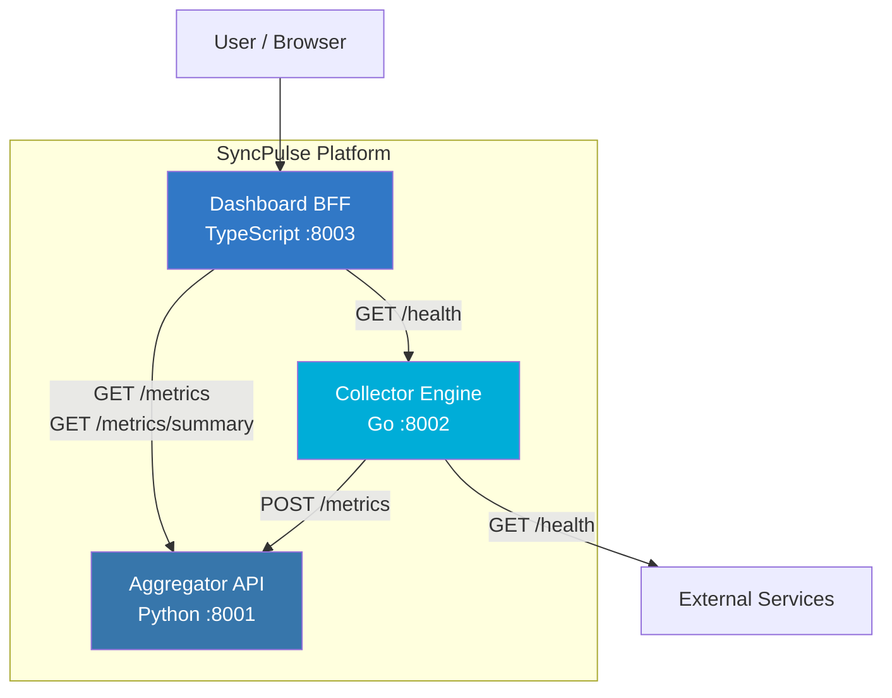

# SyncPulse

Microservice Health Monitoring & Metrics Aggregation Platform.

SyncPulse provides real-time health monitoring, metrics collection, and a unified dashboard for distributed microservice architectures. It consists of three services built with Python, Go, and TypeScript.

## Architecture



### Services

| Service | Language | Port | Description |
|---------|----------|------|-------------|
| **Aggregator** | Python (Flask) | 8001 | Receives, stores, and serves collected metrics |
| **Collector** | Go (net/http) | 8002 | Monitors target services and reports health/latency |
| **Dashboard** | TypeScript (Express) | 8003 | BFF providing unified API for frontend consumers |

## Quick Start

### Prerequisites

- Docker & Docker Compose
- Or: Python 3.12+, Go 1.22+, Node.js 20+

### Using Docker Compose

```bash
# Copy environment config
cp .env.example .env

# Start all services
make up
# or
docker compose up -d --build

# Verify health
curl http://localhost:8001/health
curl http://localhost:8002/health
curl http://localhost:8003/health

# Stop services
make down
```

### Local Development

```bash
# Python Aggregator
cd services/aggregator
pip install -r requirements.txt
python app.py

# Go Collector (in another terminal)
cd services/collector
go run .

# TypeScript Dashboard (in another terminal)
cd services/dashboard
npm install
npm run dev
```

## API Reference

### Aggregator (`:8001`)

| Method | Endpoint | Description |
|--------|----------|-------------|
| GET | `/health` | Health check |
| POST | `/metrics` | Submit metrics `{"service": "name", "metrics": {...}}` |
| GET | `/metrics` | Get all metrics (optional `?service=` filter) |
| GET | `/metrics/summary` | Get per-service summary counts |

### Collector (`:8002`)

| Method | Endpoint | Description |
|--------|----------|-------------|
| GET | `/health` | Health check |
| GET | `/targets` | List registered targets |
| POST | `/targets` | Register target `{"name": "svc", "url": "http://..."}` |
| POST | `/check` | Run health checks against all targets |
| GET | `/results` | Get historical check results |

### Dashboard BFF (`:8003`)

| Method | Endpoint | Description |
|--------|----------|-------------|
| GET | `/health` | Health check |
| GET | `/api/status` | Check health of aggregator & collector |
| GET | `/api/metrics` | Proxy metrics from aggregator |
| GET | `/api/summary` | Proxy summary from aggregator |

## Usage Example

```bash
# 1. Register a target with the collector
curl -X POST http://localhost:8002/targets \
  -H 'Content-Type: application/json' \
  -d '{"name": "aggregator", "url": "http://localhost:8001"}'

# 2. Run a health check
curl -X POST http://localhost:8002/check

# 3. Submit metrics to the aggregator
curl -X POST http://localhost:8001/metrics \
  -H 'Content-Type: application/json' \
  -d '{"service": "web-app", "metrics": {"cpu": 42.5, "memory_mb": 512}}'

# 4. View dashboard status
curl http://localhost:8003/api/status

# 5. View aggregated metrics
curl http://localhost:8003/api/metrics
```

## Testing

```bash
# Run all tests
make test

# Run individual service tests
make test-python
make test-go
make test-ts

# Run linters
make lint
```

## Environment Variables

See [`.env.example`](.env.example) for all available configuration options.

| Variable | Default | Description |
|----------|---------|-------------|
| `AGGREGATOR_PORT` | `8001` | Aggregator service port |
| `COLLECTOR_PORT` | `8002` | Collector service port |
| `DASHBOARD_PORT` | `8003` | Dashboard service port |
| `LOG_LEVEL` | `INFO` | Log verbosity (DEBUG, INFO, WARNING, ERROR) |
| `AGGREGATOR_URL` | `http://localhost:8001` | Aggregator URL for inter-service communication |
| `COLLECTOR_URL` | `http://localhost:8002` | Collector URL for inter-service communication |

## CI/CD

GitHub Actions workflow is defined in `ci.yml` (to be placed at `.github/workflows/ci.yml`).

The pipeline runs:
1. Python tests + flake8 lint
2. Go tests + go vet
3. TypeScript tests + ESLint
4. Docker Compose build verification

## License

MIT
